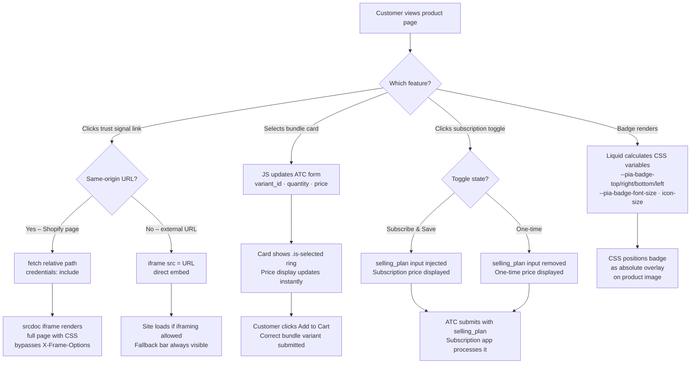

# 🛍️ Shopify: Product Info Advanced Section

A **conversion-focused product page section** for Shopify Online Store 2.0. Built for DTC and supplement brands that need social proof, urgency signals, bundle upsells, and subscribe & save, with no third-party apps.

**✅ Zero app dependencies:** bundle picker, subscription toggle, trust signals, popup modal, and media carousel are all native Liquid + vanilla JS + CSS.  
**✅ 3 files. Any theme.** Drop `sections/`, `assets/` into any Online Store 2.0 theme and add the section in the Theme Editor. Done.  
**✅ Fully configurable via the Theme Editor.** Every visual and behavioural setting is exposed in the Shopify customizer. No code edits needed after install.


---

## 📸 Visual Preview

> _Add a screen recording or screenshot here showing the section on a live product page._

---

## ✨ Key Features

### 📦 Bundle Options
- App-free bundle card picker. No Kaching, Bundle Bear, or any third-party app required
- Each bundle card has its own image, title, quantity, price label, and variant
- Selecting a card instantly updates the ATC form (variant ID, quantity, displayed price) via vanilla JS
- **Configurable image fit:** `cover` · `contain` · `fill` · `auto`
- **Configurable aspect ratio:** `1:1 Square` · `4:5 Portrait` · `Auto`
- Image options are set per-section in the customizer, no CSS overrides needed

### 🔄 Subscription Toggle
- Built-in subscribe & save toggle, no subscription app required for the UI or toggle logic
- Dynamically swaps the displayed price between one-time and subscription price on click
- Injects or removes the `selling_plan` hidden input from the ATC form in real time
- Compatible with **any** subscription app that reads Shopify's standard `selling_plan` form field: Recharge, Skio, Bold, native Shopify Subscriptions
- Default state (one-time or subscribe) is configurable in the customizer

### 🛡️ Trust Signals
- Up to 4 trust signal blocks, each independently configurable
- Supports country flag images with optional text label after the flag
- Optional **animated green pulse dot** with correct list alignment
- Three link behaviours per signal: **Redirect** · **Open Popup / Modal** · **Open New Tab**
- Popup modal: same-origin Shopify pages are fetched and rendered via `srcdoc` iframe (bypasses `X-Frame-Options`); external URLs load via direct `<iframe src>`
- "Can't see the page? Open in new tab ↗" fallback bar shown for all external iframe loads

### 🎞️ Media Carousel
- Scrollable image/video carousel for the product media gallery
- Configurable visible card count on mobile: **1** · **1.5** · **2** · **2.5**

### 🏷️ Main Image Badge
- Absolute-positioned badge overlay on the main product image
- Configurable: font size · font colour · badge background · vertical/horizontal padding
- Position: **Top-left** · **Top-right** · **Bottom-left** · **Bottom-right**
- Margin from corner, custom icon/image, and independent icon size control
- All values injected as CSS custom properties from Liquid, no JS required

---

## 📦 What's Included

```
shopify-section-product-info-advanced/
├── sections/
│   └── product-info-advanced.liquid   # Section markup, CSS variable injection, full schema
├── assets/
│   ├── product-info-advanced.css      # All section styles
│   └── product-info-advanced.js       # Interactive logic (modal, bundles, subscription, carousel)
├── .theme-check.yml                   # Linter config, documents all rule suppressions
├── INSTALL.md                         # Step-by-step installation guide
└── README.md
```

---

## 🚀 Quick Install (3 Steps)

1. **Copy the 3 files** into your existing Shopify theme:

   ```
   sections/product-info-advanced.liquid  →  your-theme/sections/
   assets/product-info-advanced.css       →  your-theme/assets/
   assets/product-info-advanced.js        →  your-theme/assets/
   ```

2. **Push to your theme** via Shopify CLI:

   ```bash
   shopify theme push --theme <theme-id> \
     --only sections/product-info-advanced.liquid \
     --only assets/product-info-advanced.css \
     --only assets/product-info-advanced.js \
     --allow-live
   ```

3. **Add the section.** In the Shopify Theme Editor, open your product page template, click **Add section**, and select **Product Info Advanced**. Configure all settings in the customizer.

> Full step-by-step: see **[INSTALL.md](INSTALL.md)**

---

## 🧩 How It Works – Architecture Flow



**Summary:** All interactive features are self-contained in one section file and two asset files. No app events, no theme dependencies, no external scripts.

---

## 🛒 Compatibility

| Your setup | Notes |
|---|---|
| **Any Online Store 2.0 theme** | Copy 3 files, push via CLI, add section in editor |
| **Shopify pages for modal** | `/pages/` URLs fetch and render fully with all CSS preserved |
| **External URLs for modal** | Loaded via `<iframe src>`, with an "Open in new tab ↗" fallback always present |
| **Bundle, no app needed** | Self-contained Liquid + JS bundle picker |
| **Recharge / Skio / Bold / Native** | Toggle injects the standard `selling_plan` field; any app that reads it works automatically |

---

## 🧪 Testing Checklist

**Trust Signals & Modal**
- [ ] Pulse dot aligns correctly with other list items
- [ ] Flag label text appears after flag image
- [ ] Open Popup modal loads and displays page content
- [ ] Modal close button (×) dismisses the modal
- [ ] External URL shows "Open in new tab ↗" fallback bar

**Media & Badge**
- [ ] Carousel shows 2.5 cards on mobile when configured
- [ ] Badge appears in the correct corner with correct styling
- [ ] Badge custom icon resizes correctly with the icon size slider

**📦 Bundle**
- [ ] Bundle cards display with correct image, title, and price label
- [ ] Selecting a bundle card updates the displayed price instantly
- [ ] Correct variant ID and quantity are submitted with Add to Cart
- [ ] Bundle image respects the configured fit and aspect ratio

**🔄 Subscription**
- [ ] Toggle renders in the configured default state on page load
- [ ] Clicking Subscribe swaps price to the subscription price
- [ ] Clicking One-time swaps price back to the standard price
- [ ] `selling_plan` field present in form when subscribe is active
- [ ] `selling_plan` field absent from form when one-time is active
- [ ] Add to Cart submits the subscription correctly

---

## 🐛 Troubleshooting

| Issue | What to try |
|---|---|
| Modal shows "refused to connect" | Target site blocks iframes. Use a Shopify page (`/pages/…`) instead |
| Modal shows blank content | Check the URL is publicly accessible |
| Badge not visible | Ensure badge text or icon is set and the section is saved |
| Bundle images look stretched | Set Image fit to `contain` and Aspect ratio to `1:1 Square` |
| Subscription not processing | Confirm a selling plan is assigned and your app reads the `selling_plan` form field |

---

## 📄 License

MIT. Free for personal and commercial use. See LICENSE. Attribution appreciated but not required.

---

## 💬 Support

- **Issues:** Open an issue on GitHub
- **Contact:** rsusano123s@gmail.com
