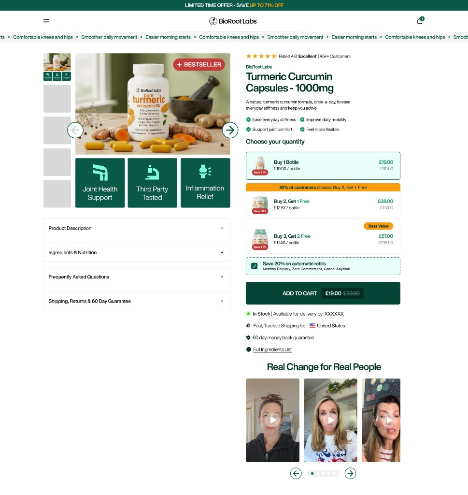
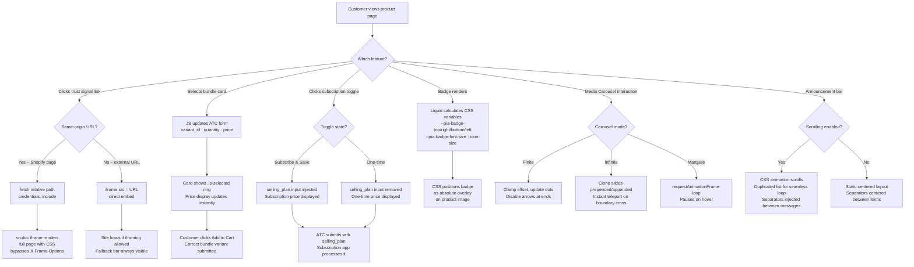

# 🛍️ Shopify: Product Info Advanced Section + Product Announcement Bar

A **conversion-focused product page section** and **announcement bar section** for Shopify Online Store 2.0. Built for DTC and supplement brands that need social proof, urgency signals, bundle upsells, and subscribe & save, with no third-party apps.

**✅ Zero app dependencies:** bundle picker, subscription toggle, trust signals, popup modal, media carousel, rating block, and benefits grid are all native Liquid + vanilla JS + CSS.  
**✅ 5 files. Any theme.** Drop `sections/` and `assets/` files into any Online Store 2.0 theme and add the sections in the Theme Editor. Done.  
**✅ Fully configurable via the Theme Editor.** Every visual and behavioural setting is exposed in the Shopify customizer. No code edits needed after install.


---

## 📸 Visual Preview

https://github.com/user-attachments/assets/8e23a847-f071-40f5-8c06-2aa086b9eb08

<table align="center" border="0" cellpadding="12">
  <tr>
    <td align="center"></td>
    <td align="center"></td>
  </tr>
  <tr>
    <td align="center"><sub>Desktop Design</sub></td>
    <td align="center"><sub>Mobile Design</sub></td>
  </tr>
</table>

---

## ✨ Key Features

### 📦 Bundle Options
- App-free bundle card picker — no Kaching, Bundle Bear, or any third-party app required
- Each bundle card has its own image, title, quantity, price label, and variant
- Selecting a card instantly updates the ATC form (variant ID, quantity, displayed price) via vanilla JS
- **Configurable image fit:** `cover` · `contain` · `fill` · `auto`
- **Configurable aspect ratio:** `1:1 Square` · `4:5 Portrait` · `Auto`
- Image options are set per-section in the customizer — no CSS overrides needed

### 🔄 Subscription Toggle
- Built-in subscribe & save toggle — no subscription app required for the UI or toggle logic
- Dynamically swaps the displayed price between one-time and subscription price on click
- Injects or removes the `selling_plan` hidden input from the ATC form in real time
- Compatible with **any** subscription app that reads Shopify's standard `selling_plan` form field: Recharge, Skio, Bold, native Shopify Subscriptions
- Default state (one-time or subscribe) is configurable in the customizer

### 🛡️ Trust Signals
- Up to 4 trust signal blocks, each independently configurable
- Supports country flag images with optional text label after the flag
- Optional **animated green pulse dot** — with correct list alignment
- Three link behaviours per signal: **Redirect** · **Open Popup / Modal** · **Open New Tab**
- Popup modal: same-origin Shopify pages are fetched and rendered via `srcdoc` iframe (bypasses `X-Frame-Options`); external URLs load via direct `<iframe src>`
- "Can't see the page? Open in new tab ↗" fallback bar shown for all external iframe loads

### ⭐ Rating Block
- Rich text rating label with full typography controls: font size, weight, text transform, bold/italic
- Star icons with configurable count, filled/empty colors, size, and gap
- Half-star support with 0.5 increments (e.g. 4.5 stars)
- Custom star icons — upload an image or paste SVG code to replace defaults
- Independent mobile controls for font size, star size, and gap settings

### 🎁 Benefits Grid
- Single block with up to 9 benefit items — replaces multiple individual blocks
- Up to 3 columns on desktop, 2 on mobile, with configurable column count
- Per-item text and icon (image or SVG) with full customization
- Global controls for font size, icon size, icon color, text color, and item gap
- Separate mobile sizing options for font and icon

### 🎞️ Media Carousel
- Configurable visible card count: desktop (2–4 cards) and mobile (1–2.5 cards)
- **Infinite looping** — seamless clone-based transition when reaching the last slide
- **Autoplay** with configurable speed
- **Marquee mode** — continuous scroll using `requestAnimationFrame`
- Show/hide navigation arrows and pagination dots independently
- Custom arrow uploads — image or SVG, resizable for desktop and mobile
- Navigation background with color, border radius, and padding controls
- Supports images, YouTube, Vimeo, MP4, and `cdn.shopify.com` video URLs
- Media fit and aspect ratio controls: `cover` · `contain` · `fill` · `1:1` · `4:5` · `16:9`
- Heading style controls: font size, color, weight, and margin top/bottom

### 🏷️ Main Image Badge
- Absolute-positioned badge overlay on the main product image
- Configurable: font size · font colour · badge background · vertical/horizontal padding
- Position: **Top-left** · **Top-right** · **Bottom-left** · **Bottom-right**
- Margin from corner, custom icon/image, and independent icon size control
- All values injected as CSS custom properties from Liquid — no JS required

### 📐 Gallery & Layout Controls
- Sticky left column for desktop — product image and left-side blocks scroll with the page while the right column continues
- Desktop image alignment offset to vertically align the media with the right column
- Gallery navigation arrow sizing for desktop and mobile with custom arrow upload support
- Mobile image margin controls to reduce or tighten spacing below the product media

### 📝 Description Block
- Font size control for desktop and mobile
- Text color control for desktop and mobile

### 📢 Product Announcement Bar
- Multiple announcement blocks with icon image or inline SVG support
- Optional scrolling marquee mode with configurable speed
- Centered separators inserted automatically between messages
- Section-level separator controls: enable/disable, style, color, and size
- Independent desktop and mobile spacing controls (margin top/bottom, padding top/bottom)
- Mobile-specific font size control
- Desktop/mobile visibility toggles

---

## 📦 What's Included

```
shopify-theme/
├── sections/
│   ├── product-info-advanced.liquid        # Section markup, CSS variable injection, full schema
│   └── product-announcement-bar.liquid     # Announcement bar markup and schema
├── assets/
│   ├── product-info-advanced.css           # All section styles (modal, badge, bundle, carousel, rating, benefits)
│   ├── product-info-advanced.js            # Interactive logic (modal, bundles, subscription, carousel, gallery)
│   └── product-announcement-bar.css        # Announcement bar styles (static + scrolling)
├── docs/
│   ├── figma-design-desktop.png            # Figma design reference — desktop
│   └── figma-design-mobile.png             # Figma design reference — mobile
├── .theme-check.yml                        # Linter config, documents all rule suppressions
├── INSTALL.md                              # Step-by-step installation guide
└── README.md
```

---

## 🚀 Quick Install (3 Steps)

1. **Copy the files** into your existing Shopify theme:
```
sections/product-info-advanced.liquid       →  your-theme/sections/
sections/product-announcement-bar.liquid    →  your-theme/sections/
assets/product-info-advanced.css            →  your-theme/assets/
assets/product-info-advanced.js             →  your-theme/assets/
assets/product-announcement-bar.css         →  your-theme/assets/
```

2. **Push to your theme** via Shopify CLI:
```bash
shopify theme push --theme <theme-id> \
  --only sections/product-info-advanced.liquid \
  --only sections/product-announcement-bar.liquid \
  --only assets/product-info-advanced.css \
  --only assets/product-info-advanced.js \
  --only assets/product-announcement-bar.css \
  --allow-live
```

3. **Add the sections.** In the Shopify Theme Editor:
   - Add **Product Info Advanced** to your product page template and configure all settings in the customizer
   - Add **Product Announcement Bar** wherever you want promotional messaging to appear

> Full step-by-step: see **INSTALL.md**

---

## 🧩 How It Works – Architecture Flow



**Summary:** All interactive features are self-contained in the section files and asset files. No app events, no theme dependencies, no external scripts.

---

## 🛒 Compatibility

| Your setup | Notes |
|---|---|
| **Any Online Store 2.0 theme** | Copy the 5 files, push via CLI, add sections in the Theme Editor |
| **Shopify pages for modal** | `/pages/` URLs fetch and render fully with all CSS preserved |
| **External URLs for modal** | Loaded via `<iframe src>`, with an "Open in new tab ↗" fallback always present |
| **Bundle — no app needed** | Self-contained Liquid + JS bundle picker |
| **Recharge / Skio / Bold / Native** | Toggle injects the standard `selling_plan` field; any app that reads it works automatically |
| **cdn.shopify.com video URLs** | Media carousel accepts direct CDN video links alongside YouTube and Vimeo |

---

## 🎨 Customizer Reference

### Main Image Badge

| Setting | Type | Description |
|---|---|---|
| Badge text | Text | Label shown on the badge |
| Badge background | Color | Badge fill colour |
| Badge font colour | Color | Text and icon colour |
| Font size | Range 10–28px | Badge text size |
| Vertical padding | Range 4–24px | Top/bottom padding inside badge |
| Horizontal padding | Range 8–32px | Left/right padding inside badge |
| Position | Select | Top-left · Top-right · Bottom-left · Bottom-right |
| Margin from edge | Range 4–40px | Distance from the corner |
| Badge icon / image | Image | Optional icon shown beside badge text |
| Badge icon size | Range 16–80px | Width/height of the custom badge image |

### Bundle Card

| Setting | Type | Description |
|---|---|---|
| Bundle image | Image | Product image for this bundle card |
| Image fit | Select | `cover` · `contain` · `fill` · `auto` |
| Aspect ratio | Select | `1:1 Square` · `4:5 Portrait` · `Auto` |
| Bundle variant | Variant | Variant added to cart when this card is selected |
| Bundle quantity | Number | Units added to cart |
| Price label | Text | Savings label e.g. "Save 20%" |

### Trust Signal

| Setting | Type | Description |
|---|---|---|
| Flag / icon image | Image | Image shown at the start of the signal |
| Flag label text | Text | Text displayed after the image |
| Link behaviour | Select | Redirect · Open Popup / Modal · Open New Tab |
| Link URL | URL | Target for the selected link behaviour |
| Enable pulse dot | Checkbox | Animated green pulse dot |

### Rating Block

| Setting | Type | Description |
|---|---|---|
| Text | Rich text | Rating label, supports bold/italic inline |
| Font size | Range | Desktop font size |
| Font weight | Select | Regular · Semi Bold · Bold · Extra Bold |
| Text transform | Select | Original · Uppercase · Lowercase |
| Mobile font size | Range | Font size override on mobile |
| Star count | Range 1–10 | Total stars displayed |
| Filled stars | Select | 0–star count in 0.5 increments |
| Star size | Range | Desktop star width/height |
| Mobile star size | Range | Star size override on mobile |
| Star color (filled) | Color | Color of filled stars |
| Star color (empty) | Color | Color of empty stars |
| Star gap | Range | Gap between individual stars |
| Mobile star gap | Range | Star gap override on mobile |
| Stars-to-text gap | Range | Gap between the star row and label text |
| Mobile stars-to-text gap | Range | Stars-to-text gap override on mobile |
| Custom icon image | Image | Upload to replace default star SVG |
| Custom icon SVG | Textarea | Paste SVG code to replace default star |

### Benefits Grid

| Setting | Type | Description |
|---|---|---|
| Desktop columns | Select | 1 · 2 · 3 |
| Mobile columns | Select | 1 · 2 |
| Item gap | Range | Gap between grid items |
| Font size | Range | Desktop label font size |
| Mobile font size | Range | Label font size on mobile |
| Icon size | Range | Desktop icon width/height |
| Mobile icon size | Range | Icon size on mobile |
| Icon color | Color | Applies to SVG icons as fill |
| Text color | Color | Label text color |
| Item 1–9 text | Text | Label for each item |
| Item 1–9 icon image | Image | Image icon for each item |
| Item 1–9 icon SVG | Textarea | SVG icon for each item |

### Media Carousel

| Setting | Type | Description |
|---|---|---|
| Heading | Text | Section heading |
| Heading font size | Range | Heading text size |
| Heading color | Color | Heading text color |
| Heading weight | Select | Regular · Semi Bold · Bold · Extra Bold |
| Heading margin top | Number | Space above the heading |
| Heading margin bottom | Number | Space below the heading |
| Visible cards (desktop) | Select | 2 · 2.5 · 3 · 3.5 · 4 |
| Visible cards (mobile) | Select | 1 · 1.2 · 1.5 · 2 · 2.5 |
| Infinite Loop | Checkbox | Seamless clone-based looping |
| Auto-slide | Checkbox | Autoplay |
| Auto-slide speed | Range | Interval between auto-advances |
| Marquee | Checkbox | Continuous scroll mode |
| Marquee speed | Range | Pixels per second |
| Show arrows | Checkbox | Display prev/next arrow buttons |
| Show dots | Checkbox | Display pagination dots |
| Dot color (inactive) | Color | Inactive dot color |
| Dot color (active) | Color | Active dot color |
| Nav background | Color | Background behind the dot area |
| Nav radius | Range | Border radius of the dot background |
| Nav padding (vertical) | Range | Vertical padding of the dot background |
| Nav padding (horizontal) | Range | Horizontal padding of the dot background |
| Arrow size (desktop) | Range | Arrow button width/height on desktop |
| Arrow size (mobile) | Range | Arrow button width/height on mobile |
| Prev arrow image | Image | Custom previous arrow image |
| Prev arrow SVG | Textarea | Custom previous arrow SVG |
| Next arrow image | Image | Custom next arrow image |
| Next arrow SVG | Textarea | Custom next arrow SVG |
| Media aspect ratio | Select | `3/4` · `1/1` · `4/5` · `16/9` · `auto` |
| Image fit | Select | `cover` · `contain` · `fill` · `auto` |
| Media 1–6 image | Image | Media slot image |
| Media 1–6 video URL | Text | YouTube, Vimeo, MP4, or cdn.shopify.com URL |

### Subscription Toggle

| Setting | Type | Description |
|---|---|---|
| Show toggle | Checkbox | Enable/disable the subscribe & save toggle |
| Default state | Select | Start on `One-time` or `Subscribe & Save` |
| Subscribe label | Text | Label for the subscribe option |
| One-time label | Text | Label for the one-time option |
| Saving badge | Text | Badge text e.g. "Save 15%" |
| Selling plan | Selling plan | Shopify selling plan injected when subscribe is active |

### Product Announcement Bar

| Setting | Type | Description |
|---|---|---|
| Background color | Color | Bar background |
| Text color | Color | Text and icon color |
| Font size | Range | Desktop text size |
| Font weight | Select | Normal · Bold |
| Text transform | Select | Normal · Uppercase |
| Padding top/bottom | Range | Desktop vertical padding |
| Margin top/bottom | Range | Desktop outer margin |
| Mobile font size | Range | Text size on mobile |
| Mobile padding top/bottom | Range | Vertical padding on mobile |
| Mobile margin top/bottom | Range | Outer margin on mobile |
| Enable scrolling | Checkbox | Activates marquee scroll mode |
| Scroll speed | Range | Seconds to complete one full loop |
| Enable separator | Checkbox | Show separators between messages |
| Separator style | Select | Dot · Line · Icon |
| Separator size | Range | Separator width/height in px |
| Separator color | Color | Separator color |
| Show on mobile | Checkbox | Visibility toggle for mobile |
| Show on desktop | Checkbox | Visibility toggle for desktop |

### Announcement Block

| Setting | Type | Description |
|---|---|---|
| Text | Rich text | Message content |
| Icon image | Image | Icon shown beside the message |
| Icon SVG | Textarea | SVG icon shown beside the message |
| Icon size | Range | Icon width/height |
| Link URL | URL | Optional link wrapping the announcement |

---

## 🧪 Testing Checklist

**Trust Signals & Modal**
- [ ] Pulse dot aligns correctly with other list items
- [ ] Flag label text appears after flag image
- [ ] Open Popup modal loads and displays page content
- [ ] Modal close button (×) dismisses the modal
- [ ] External URL shows "Open in new tab ↗" fallback bar

**Media & Badge**
- [ ] Carousel shows 2.5 cards on mobile when configured
- [ ] Badge appears in the correct corner with correct styling
- [ ] Badge custom icon resizes correctly with the icon size slider
- [ ] Media Carousel infinite mode loops cleanly without empty end space
- [ ] Media Carousel nav background covers only the dots area
- [ ] Last pagination dot activates when reaching the final slide
- [ ] Autoplay pauses on hover and resumes on mouse leave
- [ ] Marquee scrolls continuously and pauses on hover
- [ ] Custom carousel arrows resize correctly on desktop and mobile
- [ ] cdn.shopify.com video URLs load and play correctly

**📦 Bundle**
- [ ] Bundle cards display with correct image, title, and price label
- [ ] Selecting a bundle card updates the displayed price instantly
- [ ] Correct variant ID and quantity are submitted with Add to Cart
- [ ] Bundle image respects the configured fit and aspect ratio

**🔄 Subscription**
- [ ] Toggle renders in the configured default state on page load
- [ ] Clicking Subscribe swaps price to the subscription price
- [ ] Clicking One-time swaps price back to the standard price
- [ ] `selling_plan` field present in form when subscribe is active
- [ ] `selling_plan` field absent from form when one-time is active
- [ ] Add to Cart submits the subscription correctly

**⭐ Rating & Benefits**
- [ ] Half-stars render correctly at 0.5 increments
- [ ] Custom star icon scales with the star size setting
- [ ] Benefits Grid shows correct column count on desktop and mobile
- [ ] Benefits Grid icon and text sizing settings apply correctly

**📐 Layout**
- [ ] Sticky left column holds product media in place on desktop while the right column scrolls
- [ ] Main gallery custom arrows scale correctly when size is reduced or increased
- [ ] Desktop image alignment offset shifts the media column vertically as expected

**📢 Announcement Bar**
- [ ] Separators appear centered between each message
- [ ] Scrolling mode repeats cleanly without a visible gap between loops
- [ ] Mobile font size and spacing settings render correctly
- [ ] Show on mobile / show on desktop toggles hide the section as expected

---

## 🐛 Troubleshooting

| Issue | What to try |
|---|---|
| Modal shows "refused to connect" | The target site blocks iframes via `X-Frame-Options`. Use a Shopify page (`/pages/…`) instead — these always load correctly |
| Modal shows blank content | Check the URL is publicly accessible. Password-protected pages may not load |
| Badge not visible | Ensure badge text or icon is set in the customizer and the section is saved |
| Bundle images look stretched | Set Image fit to `contain` and Aspect ratio to `1:1 Square` |
| Subscription not processing | Confirm a selling plan is assigned and your subscription app reads the standard `selling_plan` form field |
| Sticky left column not working | Ensure no ancestor element has `overflow: hidden` — use `overflow: clip` instead if needed |
| Carousel last dot never activates | Make sure you are on the latest version; the fix changed the next-button disable logic |
| Infinite carousel shows empty space | Check that slides are populated consecutively (no gaps between media slots) |
| Custom arrows look distorted | Remove hardcoded `width`/`height` HTML attributes and use CSS `width: 100%; height: 100%` |
| Announcement bar has gap during scroll | The separator trailing logic requires at least one separator enabled and `enable_scrolling` on |

---

## 📄 License

MIT. Free for personal and commercial use. See LICENSE. Attribution appreciated but not required.

---

## 💬 Support

- **Issues:** Open an issue on GitHub
- **Contact:** rsusano123s@gmail.com
